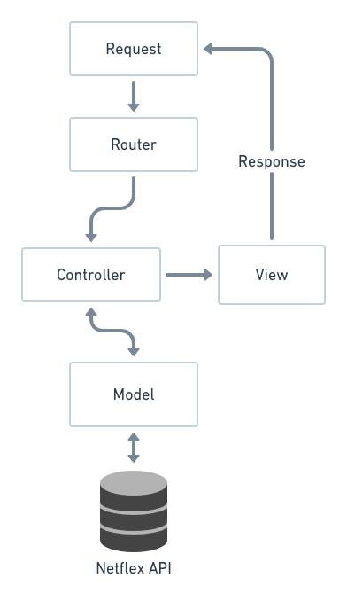
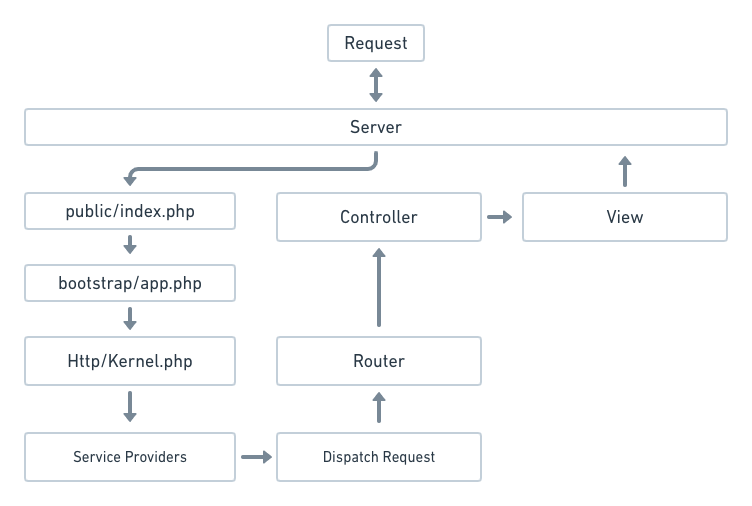

# Architecture

The Netflex SDK is an MVC framework. It is a software architecture standard that separates the representation of information from users interaction with it.

Model view controller (MVC) is a very useful and popular design pattern. Unfortunately it's also one of the hardest to truly understand.

## What is MVC

In a typical application you will find these three fundamental parts:

### Model
Model objects are the parts of the application that implement the logic for the application’s data domain. Often, model objects retrieve and store model state in a database or external api.

For example, a Article object might retrieve information from the Netflex Content API, operate on it, and then write updated information back to Netflex.

In the Netflex SDK, Models are typically represented through [Structure Models](/docs/models.md) and [Users/Customers](/docs/authentication.md). Note that Pages are also internally represented as Models.

> [!NOTE]
> The model represents the data, and does nothing else. The model does NOT depend on the controller or the view.

### View
Views are the components that display the application’s user interface (UI). Typically, this UI is created from the model data. An example would be an edit view of a Article nodel that displays UI Controls based on the current state of a Article object.

### Controller
Controllers are the components that handle user interaction, work with the model, and ultimately select a view to render that displays UI. In an MVC application, the view only displays information; the controller handles and responds to user input and interaction. For example, the controller handles query-string values, and passes these values to the model, which in turn might use these values to query the backend.

1. The model represents the data, and does nothing else. The model does NOT depend on the controller or the view.
2. The view displays the model data, and sends user actions (e.g. button clicks) to the controller.
3. The controller provides model data to the view, and interprets user actions such as button clicks. The controller depends on the view and the model. In some cases, the controller and the view are the same object.

The MVC is represented by the follwing files and folders

| MVC Architecture | Application path      | File (example)        |
|------------------|-----------------------|-----------------------|
|            Model |                app/   |           Article.php |
|             View |      resources/views/ |     article.blade.php |
|       Controller | app/Http/Controllers/ | ArticleController.php |

## Request Lifecycle

When the user triggers an event in the browser, the request arrives on the web server (Apache/Nginx), where we have our application running.

The server redirects the request into public/index.php, the starting point for the application.
In the bootstrap folder, the autoloader.php is started and loads all of the files generated by composer, creating an instance if the Netflex SDK.
