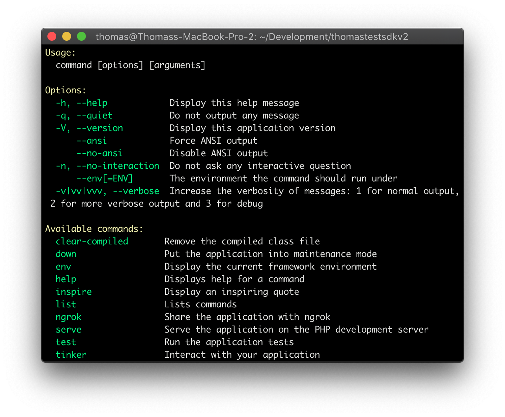
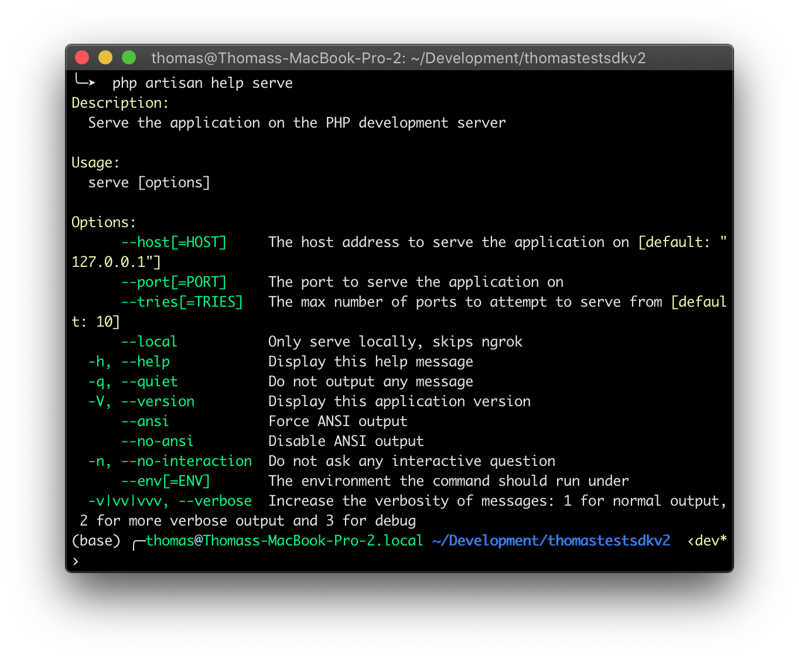
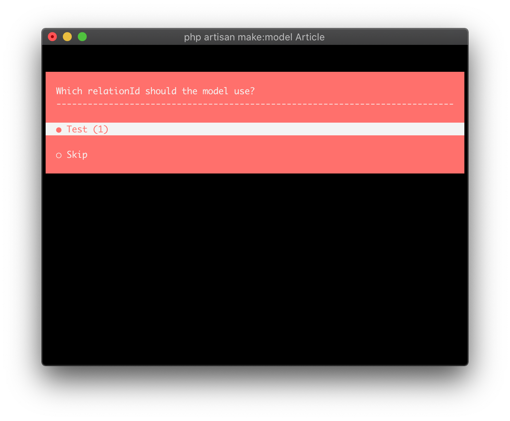

# Command Line Interface

The Netflex SDK leverages Laravels <a href="https://laravel.com/docs/7.x/artisan" target="_blank">Artisan</a> CLI to automate some common tasks, and provide easy bootstrapping of models and other things.

All the common artisan commands are available. Some have been extended or modified to work better with the Netflex ecosystem. Some have been added specifically to support Netflex development.

## Help command

To get a full overview over available command, use the built-in help command.

```bash
php artisan
```



To get help for a specific command

```bash
php artisan help <command-name>
```



## Serving your project

Artisan provides the serve command to spin up a local webserver for testing. The Netflex SDK augments this command with automatic Proxy tunnelling through [Ngrok](https://ngrok.com), and integration with Netflex Editor Proxy.

```bash
php artisan serve
```

The default port is 8000. If the port is unavailable, Artisan will increment port until it finds a free port. You may specify an alternative port manually.

```bash
php artisan serve --port=9000
```

If you don't want to establish the Ngrok tunnel, and set the Netflex Editor Proxy, you can force the server to be local.

```bash
php artisan serve --local
```

**Supported flags**

| Name    | Description                                                         |
|---------|---------------------------------------------------------------------|
|  --host | The host address to serve the application on (default: "127.0.0.1") |
|  --port | The port to serve the application on (default: 8000)                |
| --tries | The max number of ports to attempt to serve from (default: 10)      |
| --local | Only serve locally, skips ngrok                                     |


## Generating models

Artisan provides a tool to automatically generate models. This command has been augmented to handle the integration with [Netflex Structures](/docs/models.md).

```bash
php artisan make:model Article
```

You will be prompted to specify which Structure this model should be bound to. You may also specify this manually by using the `--directory` flag.



```bash
php artisan make:model Article --directory=10000
```

To automatically generate a resource controller for this Model, you can use the `--resource` flag.

```bash
php artisan make:model Article --resource
```

This will create `app/Http/Controllers/ArticleController.php` automatically.

**Supported flags**

| Name         | Shorthand | Description                                                           |
|--------------|-----------|-----------------------------------------------------------------------|
|       --all  |        -a | Generate a resource controller for the model                          |
| --directory  |        -d | Specifies the directory id for the model                              |
| --controller |        -c | Create a new controller for the model                                 |
|      --force |           | Create the class even if the model already exists                     |
|   --resource |        -r | Indicates if the generated controller should be a resource controller |
|        --api |           | Indicates if the generated controller should be an api controller     |
