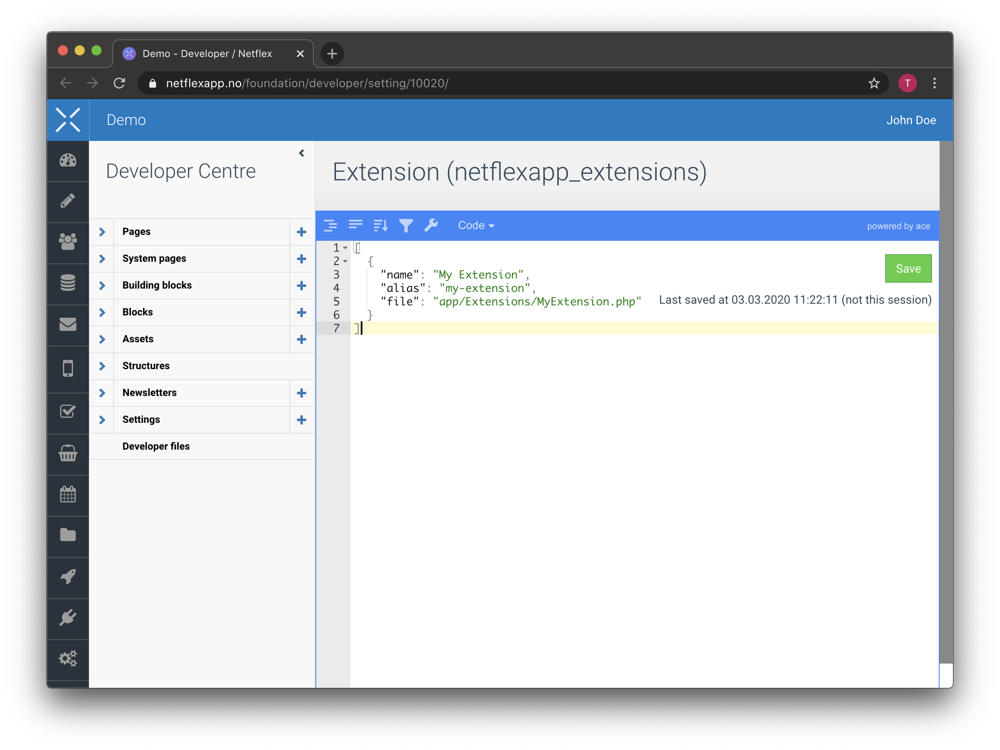

# Netflexapp Extensions

Netflexapp is extendable through Extensions. It allows you to add custom views inside the Extensions menu of Netflexapp.

> [!NOTE]
> Your account needs to have developer and extension permissions to be able to register and view extensions.

## Writing extensions

Writing extensions are easy. You simple extend the Extension class, and define a view.

You may store you extensions wherever you want. But the convention is to store them inside `app/Extensions`

```php
<?php

namespace App\Extensions;

use Netflex\Pages\Extension;

class MyExtension extends Extension
{
  protected $view = 'extensions.my-extension';
}
```

## Registering extensions

You will have to register you extension in Netflexapp, and inside you application.

Navigate to `Settings/All Settings/netflexapp_extensions` and click on `Edit in developer centre`.



> [!NOTE]
> The `file` parameter is currently required. It is not used for any purposes, but is a leftover from the legacy Netflex SDK v1.3. It needs to be set, and cannot be empty, or else the extension will not get listed.

You will also need to register you extension, otherwise, the Netflex SDK router will not be able to locate you extension.

It must be registered with the same `alias` as you used in the Netflexapp setting.

The registration needs to happen before the application is bootstrapped. You might consider creating a custom [ServiceProvider](https://laravel.com/docs/7.x/providers) for this purpose. However, you could also just do it in the default AppServiceProvider located in `app/Providers`.

```php
<?php

namespace App\Providers;

use Illuminate\Support\ServiceProvider;
use Netflex\Pages\Extension;

use App\Extensions\MyExtension;

class AppServiceProvider extends ServiceProvider
{
    public function register()
    {
        // Registers the extension and
        // makes it available through Netflexapp with the alias 'my-extension'
        Extension::register('my-extension', MyExtension::class);
    }
}

```

## Advanced

Maybe you want to pass some data to your view, or handle a form request. In that case, you should override the `handle` method of your extension.

```php
<?php

namespace App\Extensions;

use API;
use Netflex\Pages\Extension;
use Illuminate\Http\Request;

class MyExtension extends Extension
{
  public function handle (Request $request)
  {
    $variable = Variable::get('my-variable');
    $this->data['variable'] = $variable;
    // Variables defined in the 'data' array will be injected into the view when rendered.

    if ($request->method() === 'POST') {
      API::put('foundation/variables/my-variable', [
        'value' => json_encode($request->get('value'))
      ]);

      $variable = Variable::get('my-variable');
      $this->data['variable'] = $variable;
      $this->data['message'] = 'Variable was updated';
    }

    return $this->toResponse($request);
  }
}
```

