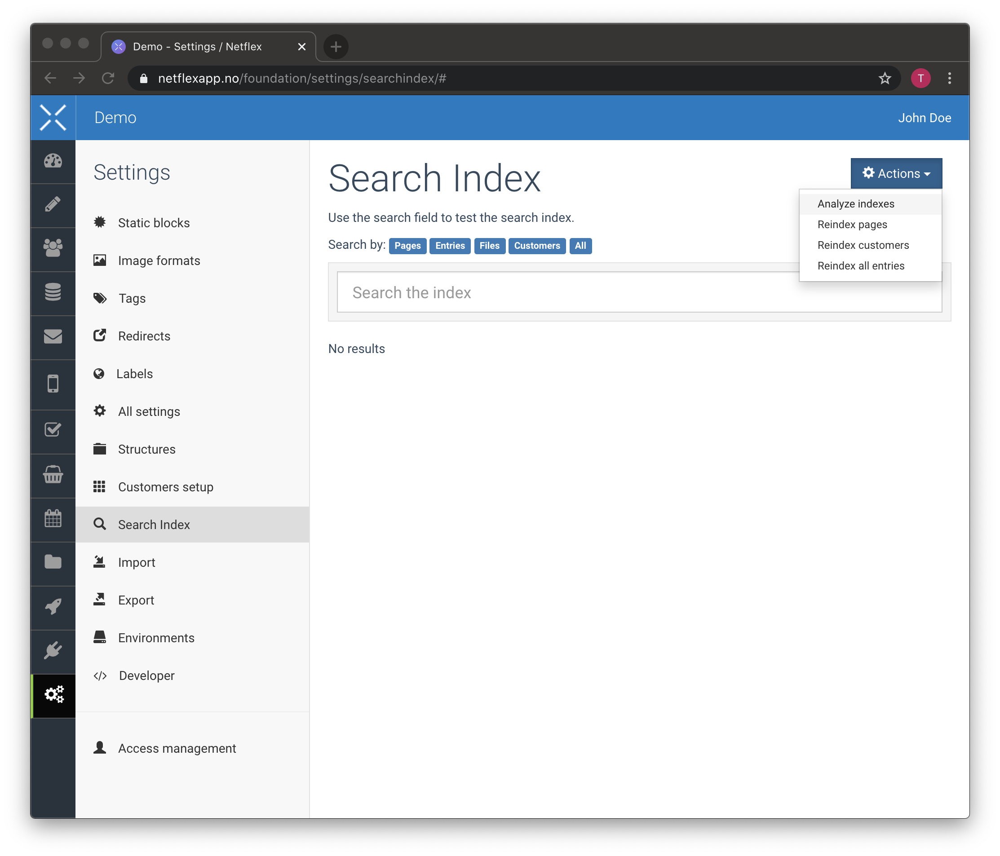
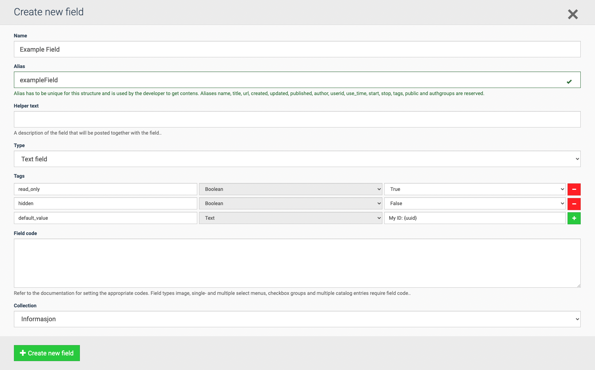

# FAQ

## How do I migrate from Netflex SDK v2?

Update your `netflex/*` dependencies in your `composer.json` to target `^3.0`.

Then run

```bash
composer update
```

## BindingResolutionException target class App\\Http\\Controllers\\{{ ControllerName }} does not exist

This exception can occur when navigating to a Netflex defined route if the template of the page has defined a custom controller, but the controller class that it points to doesn't exist in your project.

To fix this, implement the controller:

```bash
php artisan make:controller --custom {{ ControllerName }}
```

## The post-autoload-dump event returned with error code 1

This can happen when a previous auto-discovered package has been removed. As Laravel caches the discovered services and packages.

To fix this, manually remove the cache files:

```bash
rm storage/sdk/cache/packages.php
rm storage/sdk/cache/services.php
```

To permanently fix this for future updates, add the follow as the first item in the `post-autoload-dump`, `post-install-cmd` and `post-update-cmd` array in your `composer.json`

```json
"rm -f storage/sdk/cache/*.php"
```

## Root composer.json required facade/ignition ^2.37

The ignition package broke semver. To fix this, pin `facade/ignition` to `^2.10` in your `composer.json` file, and run `composer update`

## MissingCredentialsException when serving project.

See: [Netflex API/Configuration](/docs/api.md?id=configuration)

This happens because your projects is missing its credentials. Without the right credentials, the Netflex SDK can't communicate with the Netflex API.

In your project, you should have a `.env` file in the root path. Here you must configure the keys `NETFLEX_PUBLIC_KEY` and `NETFLEX_PRIVATE_KEY`. We recommend that you copy the [.env.example](https://github.com/NetflexSites/sdk-template-standard/blob/dev/.env.example) file to `.env`, and configure it from there.

> [!DANGER]
> Never commit the `.env` file. It should be added to your `.gitignore`. It is considered a potential security risk to have the keys in your Git history. If you need to configure the `.env` file when deploying to your development or production environment, please refer to [the guide](#configuring-environment-variables).

## QueryException (Invalid query: *) when using Models

See: [Models/Retrieving entries and performing queries](/docs/models.md?id=retrieving-entries-and-performing-queries)

This can happen if the internal [ElasticSearch](https://www.elastic.co/) index has not yet been indexed. This can typically occur if you are working on a new site, and its search indexes has not yet been generated.

> [!NOTE]
> You might also get this error simply due to performing an actually invalid query.

This can be fixed manually by going into Settings in Netflexapp, and performing a "Analyze indexes" action.



## How do I configure a field in a Structure entry?

Fields in a Structure can be configured by setting configuration tags.

> [!WARNING]
> This is an advanced topic. Misconfiguring this could have unforseen consequences.



### Supported tags

| Alias         | Description                                                                                                                       |
|---------------|-----------------------------------------------------------------------------------------------------------------------------------|
| read_only     | Determines if the field should be "read-only". It will only be editable the first time it is created.                             |
| hidden        | Hide or show the field.                                                                                                           |
| default_value | Allows you to set a default value for the field when the entry is created. For matrix fields this must be set for each sub field. |
| max_items     | Sets a limit to how many items a matrix field can contain.                                                                        |
| query_append  | For entry, entries, customer and customers fields, this appends the given query when searching for items                          |
| slug          | Generates a URL slug from the given field                                                                                         |

### default_value

The `default_value` tags also supports a few magic keywords that can be used to insert dynamic data at creation time.
The values follows this format: `{keyword}` and `{keyword:parameters}`

| Keyword   | Parameters                                                                            | Example                                                           | Description                                                                                             |
|-----------|---------------------------------------------------------------------------------------|-------------------------------------------------------------------|---------------------------------------------------------------------------------------------------------|
| uuid      | *None*                                                                                | `{uuid}`                                                          | Inserts a [UUID](https://en.wikipedia.org/wiki/Universally_unique_identifier)                           |
| date      | [Textual datetime description](https://www.php.net/manual/en/function.strtotime.php)  | `{date:+4 days}`                                                  | Inserts a date in the format `YYYY-MM-DD`                                                               |
| datetime  | [Textual datetime description](https://www.php.net/manual/en/function.strtotime.php)  | `{datetime:-16 hours}`                                            | Inserts a date and time in the format `YYYY-MM-DD HH:MM`                                                |
| time      | [Textual datetime description](https://www.php.net/manual/en/function.strtotime.php)  | `{time:-16 hours}`                                                | Inserts time in the format `HH:MM`                                                                      |
| timestamp | `milliseconds`                                                                        | `{timestamp}` `{timestamp:milliseconds}`                          | Inserts the current [UNIX timestamp](https://en.wikipedia.org/wiki/Unix_time)                           |
| random    | `min,max` or `[...]`                                                                  | `{random:1,6}` `{random:['red', 'green']}`                        | Picks a random integer between min and max (inclusive), or picks a random item from the specified array |

> [!TIP]
> The various keywords can be combined and mixed with static text e.g: `item-{uuid}-created-{datetime}-{random:1,10000}`
