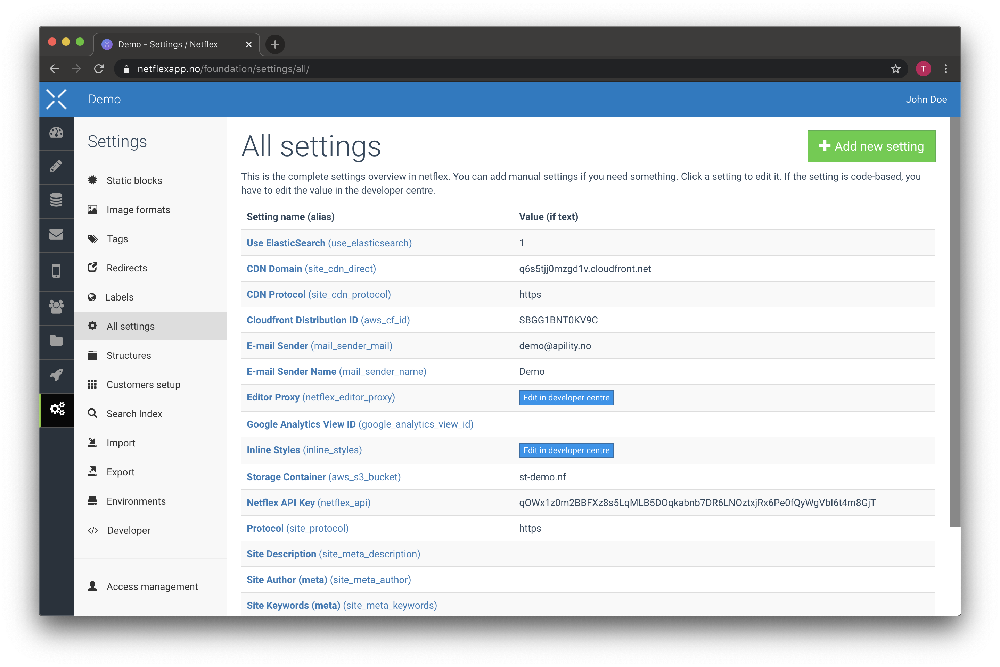

# Foundation

`netflex/foundation` is a package that provides a lot of base features, like Variables, Labels, Templates, Redirects and Global content for your app.

## Variables

Variables in Netflex applications are a key value store. It is used for many things, including credentials storage, and modifying the behaviour of your app.

Variables are managed through Netflexapp.



To retrieve a Variable, it is recommended to use the helper method provided by Foundation

```php
<?php

$cdn = get_setting('site_cdn_url');
```

You can however interact with Variables directly, by using the Variable class provided by Foundation.

```php
<?php

use Netflex\Foundation\Variable;

// Fetching the full Variable object (id, type, etc)
$cdnVariable = Variable::retrieve('site_cdn_url');

// Fetching the actual value of a Variable
$cdn = Variable::get('site_cdn_url');
```

## Labels

You can retrieve labels using the Label class. It is however usually not required, as this is automatically handled using the [Internationalization integration](/docs/i18n.md) (also provided by Foundation).

```php
<?php

use Netflex\Foundation\Label;

$labels = Label::all();
```

## Redirects

You can retrieve redirects using the Redirect class. It is however usually not required, as this is automatically handled by the [RouteServiceProvider](/docs/routing.md) (also provided by Foundation).

```php
<?php

use Netflex\Foundation\Redirect;

$redirects = Redirect::all();
```

## Template

You can retrieve templates using the Template class. It is however usually not required, as this is automatically handled by the [RouteServiceProvider](/docs/routing.md) (also provided by Foundation).

```php
<?php

use Netflex\Foundation\Template;

$templates = Template::all();
```
